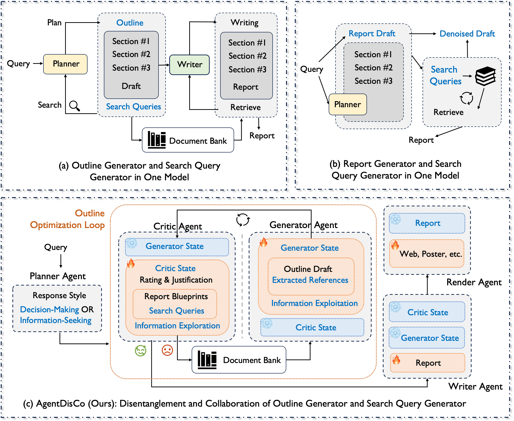
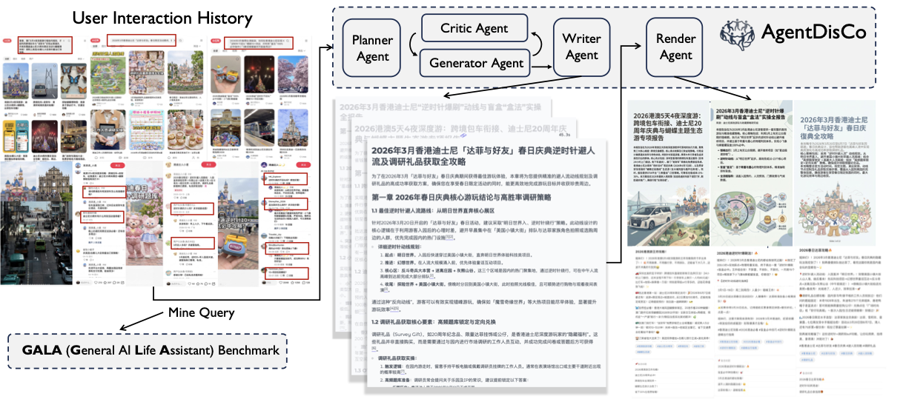
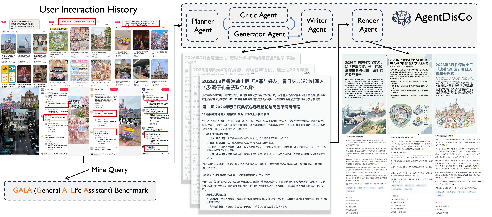
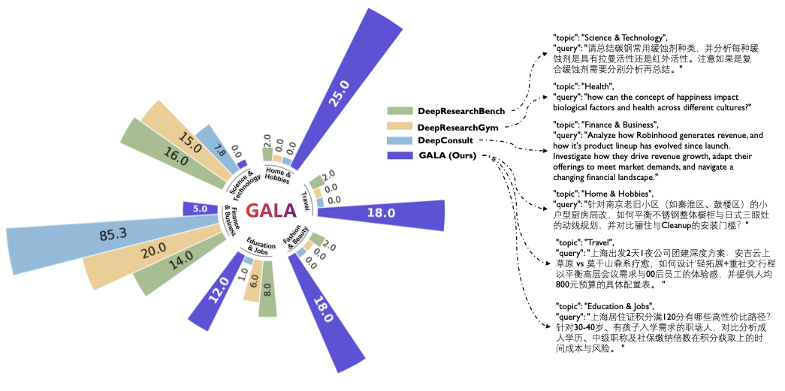
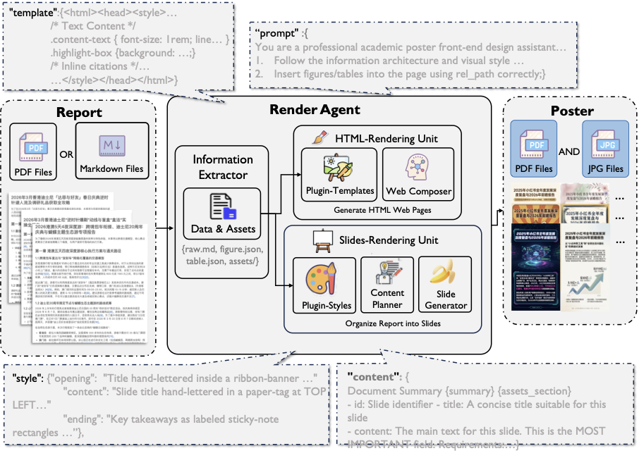
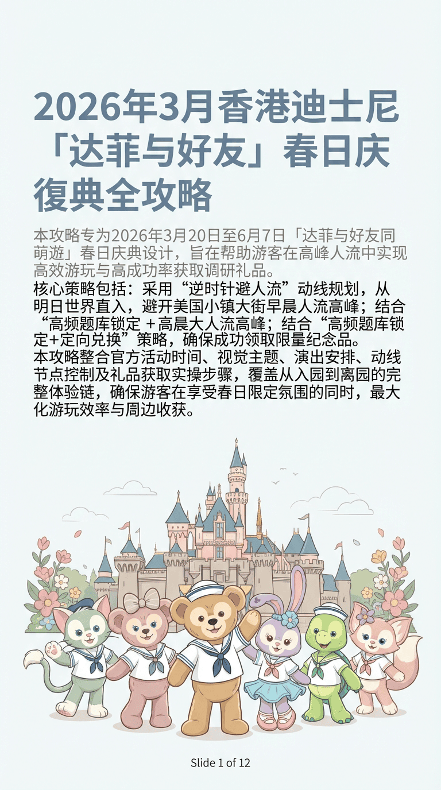
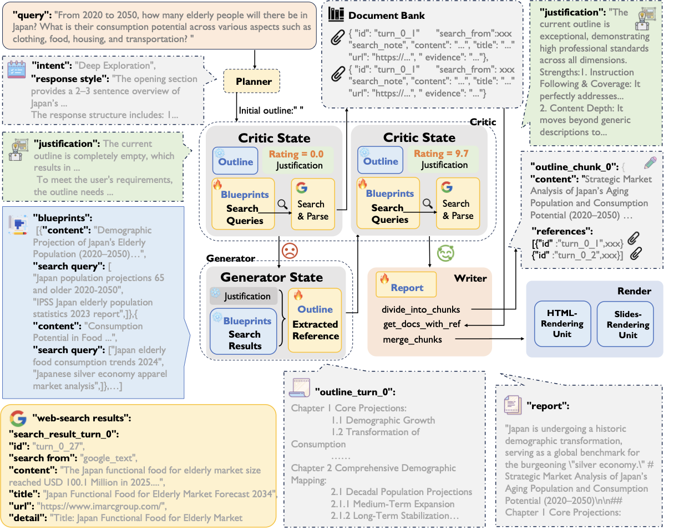

<p align="center">
  
</p>

<h1 align="center">AgentDisCo</h1>

<p align="center">
  <b>Towards Disentanglement and Collaboration in Open-ended Deep Research Agents</b>
</p>

<p align="center">
  Jiarui Jin, Zexuan Yan, Shijian Wang, Wenxiang Jiao, Yuan Lu<br>
  <b>Xiaohongshu Inc.</b>
</p>

<p align="center">
  <a href="https://agentdisco-project.github.io/">Project Page</a> |
  <a href="https://arxiv.org/abs/2604.00000">arXiv</a> |
  <a href="https://github.com/AgentDisCo-Project">Code</a> |
  <a href="https://agentdisco-project.github.io/#gala-benchmark">GALA Benchmark</a> |
  <a href="https://agentdisco-project.github.io/#renderer-gallery">Renderer Gallery</a>
</p>

---

## Overview

**AgentDisCo** is a **Dis**entangled and **Co**llaborative architecture for open-ended deep research agents. Instead of coupling information **exploration** (search-query planning) and information **exploitation** (outline/report synthesis) inside one monolithic module, AgentDisCo separates them into a critic-generator research loop:

- The **Critic Agent** evaluates the evolving outline, identifies missing evidence, and emits gap-aware blueprints with targeted search queries.
- The **Generator Agent** retrieves new evidence, updates the outline, and maintains grounded references through a persistent document bank.
- The converged outline is passed to a **Writer Agent** for long-form synthesis and then to a **Render Agent** for HTML pages, posters, slides, and Rednote-style deliverables.

<p align="center">
  
</p>

## Highlights

- **Disentangled exploration and exploitation.** AgentDisCo formulates deep research as an adversarial-yet-collaborative optimization process between search-query generation and outline synthesis.
- **Blueprint-centered iterative research.** Each blueprint binds a report section to dedicated search queries, making retrieval more structured and incremental across rounds.
- **Document bank for citation fidelity.** Retrieved references are filtered, summarized, indexed, and carried across turns to reduce context noise and citation drift.
- **Meta-optimization harness.** Code-generation agents such as Claude Code or Codex can explore agent configurations and construct a reusable policy bank for search-query strategies.
- **GALA benchmark.** We introduce **General AI Life Assistants (GALA)**, a lifestyle-oriented deep research benchmark mined from real user interaction histories.
- **Multimodal render agent.** Structured reports can be transformed into webpages, poster cards, slides, and Rednote-style content for end-user consumption.

## Architecture

AgentDisCo runs a planner-to-render pipeline:

1. **Planner Agent** classifies the user query into intent categories and response style.
2. **Critic Agent** scores the current outline and proposes blueprints with targeted subqueries.
3. **Generator Agent** retrieves evidence and revises the outline plus references.
4. **Document Bank** keeps a citation-ready memory of useful evidence across optimization rounds.
5. **Writer Agent** expands the converged outline into a grounded Markdown report.
6. **Render Agent** packages the report into visual outputs such as HTML pages, posters, or slide decks.

<p align="center">
  
</p>

## Meta-Optimization Harness

AgentDisCo can optimize its own search strategy through an outer harness. In this setting, the generator agent is repurposed as a scoring agent that evaluates critic outputs and produces quality signals over search results. A code-generation agent then uses these signals to evolve reusable strategies in a **policy bank**, enabling systematic improvement of query generation across tasks and retrieval domains.

<p align="center">
  
</p>

## GALA Benchmark

Existing deep research benchmarks are often concentrated in academic, technical, or consulting-style queries. **GALA** targets a different regime: everyday information needs from real user behavior.

We mine latent deep research interests from Rednote user interaction histories, synthesize candidate queries with an agentic workflow, and distill a high-quality benchmark through LLM screening plus human verification. GALA emphasizes lifestyle categories such as **Home & Hobbies**, **Travel**, and **Fashion & Beauty**, complementing prior benchmarks like DeepResearchBench, DeepConsult, and DeepResearchGym.

<p align="center">
  
</p>

## Results

Using **Gemini-2.5-Pro** as the base model, AgentDisCo achieves competitive or leading performance across public deep research benchmarks:

- **DeepResearchBench:** AgentDisCo w/ Harness reaches **51.90 RACE overall**, outperforming strong open and closed deep research baselines in the reported setting.
- **DeepConsult:** AgentDisCo w/ Harness achieves **66.86% win rate** and **6.96 average score**, surpassing compared systems under the pairwise evaluation protocol.
- **DeepResearchGym:** AgentDisCo w/ Harness reaches **96.77 overall**, with strong performance on balance, breadth, support, depth, and insightfulness.
- **GALA:** AgentDisCo provides the reference reports and evaluation harness for lifestyle-oriented open-ended research queries.

## Render Agent

The render agent converts structured research reports into multiple presentation modalities. It extracts salient points from Markdown or PDF reports, organizes them into template-specific assets, and renders the final result as webpages, posters, slide decks, or Rednote-style vertical images.

<p align="center">
  
</p>

<p align="center">
  
  &nbsp;&nbsp;
  
</p>

## End-to-End Showcase

The system supports the full path from a user query to a refined outline, grounded report, and visual presentation. A running example follows a query about Japan's aging population from planning through critic-generator optimization, writing, and rendering.

<p align="center">
  
</p>

## Resources

- Project page: <https://agentdisco-project.github.io/>
- Paper PDF: <https://agentdisco-project.github.io/static/pdfs/Deep_Research_XHS.pdf>
- RACE data: <https://agentdisco-project.github.io/race_data.jsonl>
- Renderer gallery: <https://agentdisco-project.github.io/#renderer-gallery>

## Citation

```bibtex
@article{agentdisco2026,
  title   = {AgentDisCo: Towards Disentanglement and Collaboration in Open-ended Deep Research Agents},
  author  = {Jin, Jiarui and Yan, Zexuan and Wang, Shijian and Jiao, Wenxiang and Lu, Yuan},
  journal = {arXiv preprint},
  year    = {2026}
}
```